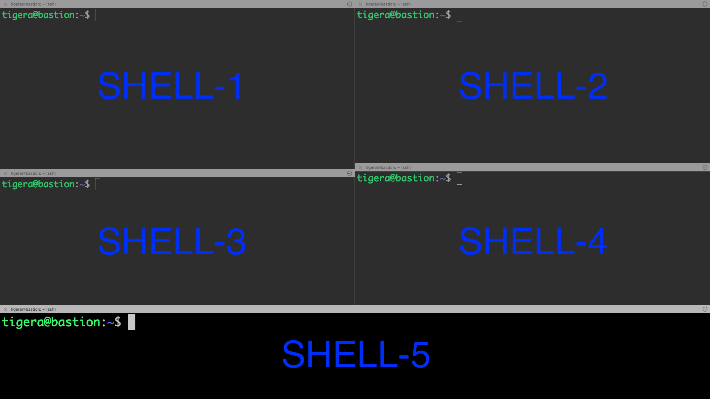

# Securing Data-in-Transit with Calico & WireGuard - DEMO

### Content of this repo

* [Thank You!](#thank-you)
* [Overview](#overview)
* [Before you begin...](#before-you-begin)
* [Demo](#demo)

### Thank you!

Thank you for attending the Open Source Summit in Vienna and the presentation on "Securing Data-in-Transit with Calico & WireGuard" by Tigera.

We hope you enjoyed the presentation and please feel free to download the slides from [here](etc/Open%20Source%20Summit%20-%20Vienna%202024%20-%20Davide%20Sellitri.pdf).

We also encourage you to leave a feedback [here](https://forms.gle/xfkUGRvca4uw7qT77), about the presentation or Project Calico. You feedback is valuable!

______________________________________________________________________________________________________________________________________________________________________

### Overview

In this demo, we'll deploy a `daemonset` which ensures that a `busybox` container runs on every node in the Kubernetes cluster. The container executes a simple shell loop that keeps it running indefinitely, sleeping for one hour in each cycle. The container also exposes port `12345` and is configured with a TTY enabled. The `DaemonSet` is deployed in the `nc` namespace and is labeled with `app: nc`. The scope of this `daemonset` is to allow `nc` (Netcat) communication on port `12345` amoung pods on different nodes.

Afterwards, we'll sniff packets on the 2 nodes where `nc` client and server are running.

Then, we will send some `hello` messages via `nc` and see if the message is shown in plain text in `tcpdump`.

Finally, we will enable WireGuard and make sure that messages are no longer visible in plain text.

______________________________________________________________________________________________________________________________________________________________________

### Before you begin...

**Terminology**

- Inter-node pod traffic: Traffic leaving a pod from one node destined to a pod on another node
- Inter-node, host-network traffic: traffic generated by the node itself or a host-networked-pod destined to another node or host-networked-pod
- Same-node pod traffic: Traffic between pods on the same node

**Supported encryption**

- Inter-node pod traffic: IPv4 only
- Inter-node, host-network traffic, IPv4/IPv6: supported only on managed clusters deployed on EKS and AKS

**Supported platforms**

- Kubernetes, on-premises using Calico CNI
- EKS using Calico CNI
- EKS using AWS CNI
- AKS using Calico CNI
- AKS using Azure CNI

**Unsupported**

- Encrypted same-node pod traffic
- GKE
- Using your own custom keys to encrypt traffic

**Required**

- Calico must be installed in the cluster. Should you need help install Calico Open Source, please choose and follow the relevant documentation from [here](https://docs.tigera.io/calico/latest/getting-started/kubernetes/).


- On all nodes in the cluster that you want to participate in Calico encryption, verify that the operating system(s) on the nodes are installed with [WireGuard](https://www.wireguard.com/install/).

  > **NOTE:**
  > Some node operating systems do not support Wireguard, or do not have it installed by default. Enabling Calico Wireguard encryption does not require all nodes to be installed with Wireguard. However, traffic to or from a node that does not have Wireguard installed will not be encrypted.  

- IP addresses for every node in the cluster. This is required to establish secure tunnels between the nodes. Calico can automatically do this using [IP autodetection methods](https://docs.tigera.io/calico/latest/networking/ipam/ip-autodetection).

For more information about WireGuard in Calico, please visit the [full documentation](https://docs.tigera.io/calico/latest/network-policy/encrypt-cluster-pod-traffic).
______________________________________________________________________________________________________________________________________________________________________

### Demo

WireGuard is included in Linux 5.6+ kernels, and has been backported to earlier Linux kernels in some Linux distributions. However, should you need to install it, please follow [this guide](https://docs.tigera.io/calico/latest/network-policy/encrypt-cluster-pod-traffic#install-wireguard).

At this stage, we assume that you have a cluster running, which is compatible with the requirements above.

**1.** Create the namespace `nc` where `netcat` client and server pods will be deployed:

```
kubectl create ns nc
```

**2.** Deploy `busybox` pods as a daemost set, which we'll be using for exchanging messages via `netcat`:

```
cat << EOF | kubectl apply -f -
apiVersion: apps/v1
kind: DaemonSet
metadata:
  name: nc
  namespace: nc
  labels:
    app: nc
spec:
  selector:
    matchLabels:
      app: nc
  template:
    metadata:
      labels:
        app: nc
    spec:
      containers:
      - name: nc
        image: busybox:latest
        command: ["sh", "-c", "while true; do sleep 3600; done"]
        ports:
        - containerPort: 12345
        tty: true
EOF
```

**3.** Make sure to have 5 shell tabs for this use:
    - **SHELL-1** `nc` server
    - **SHELL-2** `nc` client
    - **SHELL-3** `tcpdump` on node where `nc server` pod is deployed
    - **SHELL-4** `tcpdump` on node where `nc client` pod is deployed
    - **SHELL-5** shell to send commands to the cluster

You should have something similar to this:


**4. SHELL-5:** Run this command to get name and IP address of `nc` pods:

```
kubectl get pods -n nc -owide
```

Example of output:

```
kubectl get pods -n nc -owide
NAME       READY   STATUS    RESTARTS        AGE   IP              NODE                                         NOMINATED NODE   READINESS GATES
nc-49xqj   1/1     Running   1 (4h10m ago)   22h   10.48.116.142   ip-10-0-1-31.ca-central-1.compute.internal   <none>           <none>
nc-bl648   1/1     Running   1 (4h10m ago)   21h   10.48.127.205   ip-10-0-1-30.ca-central-1.compute.internal   <none>           <none>
```

**NOTE**
In my case:
- I will use `nc-bl648` as a `client` and `nc-49xqj` as a server
- `ip-10-0-1-30.ca-central-1.compute.internal` is `worker1` node
- `ip-10-0-1-31.ca-central-1.compute.internal` is `worker2` node


**5. SHELL-1:** Exec into the pod that you have identified as `nc server`:

```
kubectl exec -it -n nc nc-49xqj -- sh
```

Then launch the `netcat` server with this command:

```
nc -l -p 12345
```

**6. SHELL-2:** Exec into the pod that you have identified as `nc client`:

```
kubectl exec -it -n nc nc-bl648 -- sh
```

Then launch the `netcat` client with this command, against the `nc server` IP address, in my case `10.48.116.142`:

```
nc 10.48.116.142 12345
```

**7. SHELL-3:** SSH into the node where `nc server` pod is deployed and launch this command:

```
sudo tcpdump -ni ens5 port 12345 -A -l | grep -i 'hello'
```
    *NOTE*
    Your fabric interface name may differ from `ens5`. For example, it could be `eth0`. Make sure to adjust the command to reflect this difference.

This command captures network traffic on the `ens5` interface for port `12345` using `tcpdump`, displays the packet contents in ASCII format (`-A`), and pipes the output to `grep` to search for lines containing the case-insensitive string `hello`.

**8. SHELL-2:** SSH into the node where `nc client` pod is deployed and launch this command:

```
sudo tcpdump -ni ens5 port 12345 -A -l | grep -i 'hello'
```
    *NOTE*
    Your fabric interface name may differ from `ens5`. For example, it could be `eth0`. Make sure to adjust the command to reflect this difference.

This command captures network traffic on the `ens5` interface for port `12345` using `tcpdump`, displays the packet contents in ASCII format (`-A`), and pipes the output to `grep` to search for lines containing the case-insensitive string `hello`.

**9. SHELL-1 or SHELL-2:** Send some `hello` messages and check shell tabs where `tcpdump` is running. You can do so, by typying `hello` into the shell, either from the `nc client` or from the `nc server` shell.

You should get some packets in `SHELL-3` and `SHELL-4` and the result should look similar to this:

```
ubuntu@ip-10-0-1-30:~$ sudo tcpdump -ni ens5 -A -l port 12345 | grep "hello"
tcpdump: verbose output suppressed, use -v or -vv for full protocol decode
listening on ens5, link-type EN10MB (Ethernet), capture size 262144 bytes
.T..S...hello
.U..S..ghello
.UWoS.5.hello
```

**10. SHELL-5:** Enable WireGuard globally on all nodes, with this command:

```
kubectl patch felixconfiguration default --type='merge' -p '{"spec":{"wireguardEnabled":true}}'
```

**11.** Wait about 5/10 seconds and do step 9 again. New attempts will be encrypted by WireGuard and you won't be able to see the word `hello` in `tcpdump` anymore.

**12.** **SHELL-3 or SHELL-4:** Exit the `tcpdump` command and verify that new `hello` messages are sent via encrypted packets with WireGaurd default destination port `51820`with this command:

```
sudo tcpdump -ni any port 51820
```

Then, from SHELL-1 or SHELL-2 send some `hello` messages and you should see some packets showing up in tcpdump.

**13.** Finally, you can verify WireGuard list, by using `wg` tool. To do so, follow these steps:

**a.** **SHELL-3 or SHELL-4:** Exit the `tcpdump` command and install WireGuard tools with this command:

```
sudo apt install wireguard-tools
```

**b.** Run this command:

```
sudo wg
````

The output should look similar to this:

```
ubuntu@ip-10-0-1-30:~$ sudo wg
interface: wireguard.cali
  public key: gXXYGxphUF/EU9PhdJB4xod83U0//yEi+HO+dNIKWFM=
  private key: (hidden)
  listening port: 51820
  fwmark: 0x20000000

peer: 6UFFga/OsBy+ljgta2CwKPNV0y0At2lk/VYsmbrE3wU=
  endpoint: 10.0.1.20:51820
  allowed ips: 10.48.115.64/26, 10.48.115.64/32, 10.48.115.78/32

peer: gXwBnrAHf76yXC21qqcxSrxaKtSOcAcCtWwDEEUn9i4=
  endpoint: 10.0.1.31:51820
  allowed ips: 10.48.116.128/32, 10.48.116.128/26, 10.48.116.146/32
```

> **Congratulations! You have completed WireGuard demo! Please leave a feedback [here](https://forms.gle/xfkUGRvca4uw7qT77)**
